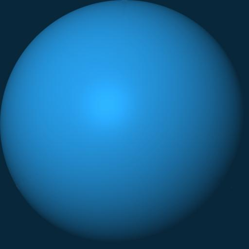

# Matlab Graphical Model Rendering-Engine

[](https://nl.mathworks.com/matlabcentral/fileexchange/127079-gmodel)

    

    

The class `Gmodel` is a graphical rendering engine for triangular mesh model. The class uses the normal vector computed for the triangular faces, to derive the appriopriate texture related to a Material Capture -- also called `matcap`. The tool comes equipped with a brouad collection of materials, including copper, steel, eggshell, jade, matte plastics, and a bunch of common textures used in Computer Graphics. On top of that, using callback function, rotating the model automatically updates the material texture. 

Usage:
```matlab
obj = Gmodel('Bunny.stl') % or any other .stl file
obj.bake.render();        % baking needs to be called at least once, render calls the figure
```

You can also force a texture update by calling
```matlab
obj.update();
```
This can be useful in for-loops.

## Installation
We highly recommend installing the essentials package using the [Matlab Package Manager](https://nl.mathworks.com/matlabcentral/fileexchange/54548-mpm?s_tid=srchtitle) (MPM), which can be easily installed via the Matlab Add-On Mananger . Once MPM is installed, the essential package can be installed by the following command in the Matlab command window

```bash
mpm install matessentials --all-paths
mpm install gmodel --all-paths
```

This will generate a folder under `MATLAB Add-Ons/Collections/mpm/mobeets-mpm-c626429/mpm-packages/gmodel/`.
