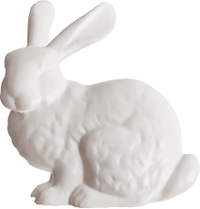
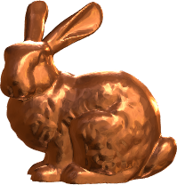

# Matlab Graphical Model Rendering-Engine

[](https://nl.mathworks.com/matlabcentral/fileexchange/127079-gmodel)

    

The class `Gmodel` is a graphical rendering engine for triangular mesh model. The class uses the normal vector computed for the triangular faces, to derive the appriopriate texture related to a Material Capture -- also called `matcap`. The tool comes equipped with a brouad collection of materials, including copper, steel, eggshell, jade, matte plastics, and a bunch of common textures used in Computer Graphics. On top of that, using callback function, rotating the model automatically updates the material texture. 

Usage:
```matlab
obj = Gmodel('Bunny.stl') % or any other .stl file
obj.bake.render();        % baking needs to be called at least once, render calls the figure
```
